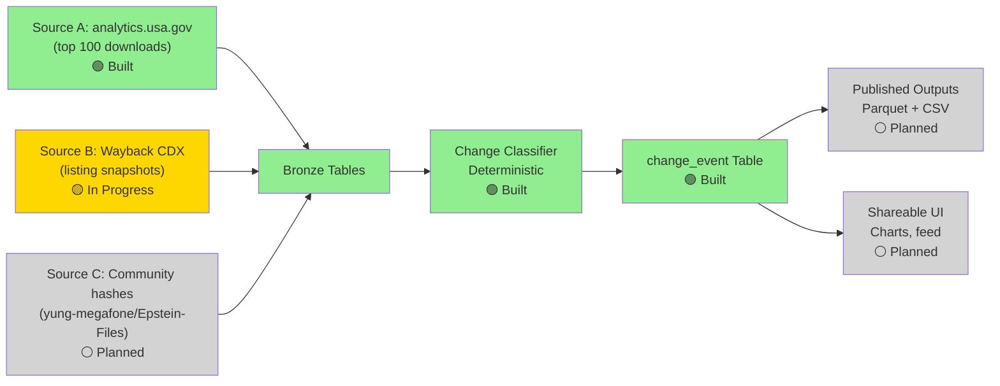

# Epstein Library Change Register

An independent completeness and change register for the DOJ Epstein Library. Tracks what was published, what moved, and what disappeared—with verifiable provenance. **This project does not host the documents themselves** (see [LIMITATIONS.md](docs/LIMITATIONS.md)).

## Problem

The DOJ Epstein Library publishes court-record and disclosure PDFs on justice.gov. Files move, appear, and disappear with little public record. A researcher, journalist, or concerned person has no way to verify:
- What was released when
- Whether specific documents are still live
- When a file was moved to a new path
- Whether redaction coverage changed

This register provides that record by polling third-party sources continuously, recording observations with verifiable provenance.

## What This Is

A dataset of **observations and derived events**, not the documents themselves:

- **Bronze tables:** Raw observations from Source A (analytics.usa.gov), Source B (Wayback listing snapshots), and Source C (community claims).
- **Change events:** Deterministic classification of observations into five event types: `added`, `removed`, `reuploaded_identical`, `reuploaded_changed`, `moved_dataset`.
- **Published outputs:** Parquet and CSV exports for reuse downstream.

What it is **not**:

- A mirror or archive of the PDFs themselves (we do not download or redistribute them).
- A complete inventory of all files on justice.gov (Source A covers ~100 most-downloaded files; Source B is in progress).
- Real-time (observations are sampled, not continuous).
- A replacement for DOJ announcements or official disclosure schedules.

Read [DECISIONS.md](DECISIONS.md) for architecture decisions and their rejected alternatives.

## Architecture



**Built** (on `main`): Source A crawler, bronze schema, change classifier (Slice 1 in progress).
**In Progress** (open branches): Source B Wayback integration (Session B2).
**Planned** (backlog): Published datasets (Slice 2), shareable UI (Slice 3), provenance hardening (Slice 4), documentation (Slice 5), redaction tracking (Slice 6, blocked by D-011).

## Status by Slice

| Slice | Purpose | Status | Done When |
|-------|---------|--------|-----------|
| **0** | Start the clock | [~] *In Progress* | 3 consecutive unattended crawls (1 of 3 complete) |
| **1** | First real output | [~] *In Progress* | Report describes a change you can verify by hand |
| **2** | Make it reusable | [ ] Planned | Stranger can reproduce numbers from docs alone |
| **3** | Shareable artifact | [ ] Planned | Can send link to stranger without caveats |
| **4** | Provenance hardening | [ ] Planned | Every removal claim has third-party evidence |
| **5** | Employer-facing | [ ] *Active* | Someone unfamiliar can explain it back to you |
| **6** | Redaction coverage | [ ] Blocked | Lawful PDF byte source needed (D-011) |

See [BACKLOG.md](BACKLOG.md) for detailed task breakdowns.

## How to Run

### Setup

```bash
uv sync
```

Output (example):
```
Resolved 15 packages in 4ms
Audited 15 packages in 53ms
```

### Environment

Set the contact URL for rate-limited requests:

```bash
export REGISTER_CONTACT="https://github.com/chrfoyer/epstein-change-register/issues"
```

(This is used in the User-Agent header for polite requests to analytics.usa.gov.)

### Tests

```bash
uv run pytest
```

Output (current):
```
32 passed in 4.45s
```

Tests cover:
- Analytics source (CSV fetch, 304 handling, error states)
- Change classifier (all event types, completeness rules, edge cases)
- Schema contract (table definitions, append-only bronze, nullable fields)
- Repo hygiene (no merge conflicts, decision IDs unique and ascending)

### Source A: Crawl top-downloads

The daily crawler runs on GitHub Actions at 05:17 UTC. To run locally:

```bash
uv run python -m register.analytics \
  --db ":memory:" \
  --import-dir ./state \
  --export-dir ./state
```

This fetches the top ~100 files from analytics.usa.gov, records them in DuckDB, and exports the state as Parquet for versioning.

### Report: What Changed

```bash
uv run register report --since 7d --format text
```

Output (when there is data):
```
Changes (last N events):
  added: 3
  reuploaded_identical: 1
  moved_dataset: 2

2026-10-03 | added                | EFTA12345678
2026-10-02 | reuploaded_identical | document.pdf
...
```

Try with `--format json` or `--format csv` for other formats.

## Cost per Run

Source A crawl duration: **13 seconds** (from GitHub Actions workflow logs).

Cost: **0 minutes of 2,000 free GitHub Actions minutes/month** (repo on public GitHub).

The crawl includes:
1. Fetch analytics.usa.gov CSV with conditional request (If-None-Match).
2. Parse CSV, extract file metadata (URL, filename, download count).
3. Filter to court-record PDFs only (exclude media and prior-disclosure paths per D-002).
4. Update DuckDB bronze tables (append-only).
5. Push state to orphan `data` branch.

## Limitations

This register cannot tell you everything. Read [LIMITATIONS.md](docs/LIMITATIONS.md) for:
- Why PDFs are not downloaded (D-011: age gate and bot check barriers)
- Why removal claims require two consecutive polls and archive proof (D-007)
- Why Source A cannot claim removals (top-100 sampling, not inventory)
- Why "identity unknown" files skip change classification (D-011 consequence)
- Why observation time ≠ publication time
- Why Slice 6 (redaction coverage) is blocked indefinitely

## Links

- [DECISIONS.md](DECISIONS.md) — Architecture decisions and rejected alternatives.
- [docs/LIMITATIONS.md](docs/LIMITATIONS.md) — What this register cannot tell you.
- [BACKLOG.md](BACKLOG.md) — Slice-by-slice work breakdown.
- [GitHub Issues](https://github.com/chrfoyer/epstein-change-register) — Bug reports, questions, contributions.

## Licence

Code and documentation: TBD (see D-018 proposal).
Published metadata: TBD (see D-018 proposal).

---

**What changed?** See the latest change events:

```bash
uv run register report --since 7d --format text
```

**How does this work?** See [docs/HANDOVER.md](docs/handover/preamble.md) (session notes) and run the test suite:

```bash
uv run pytest -v
```
